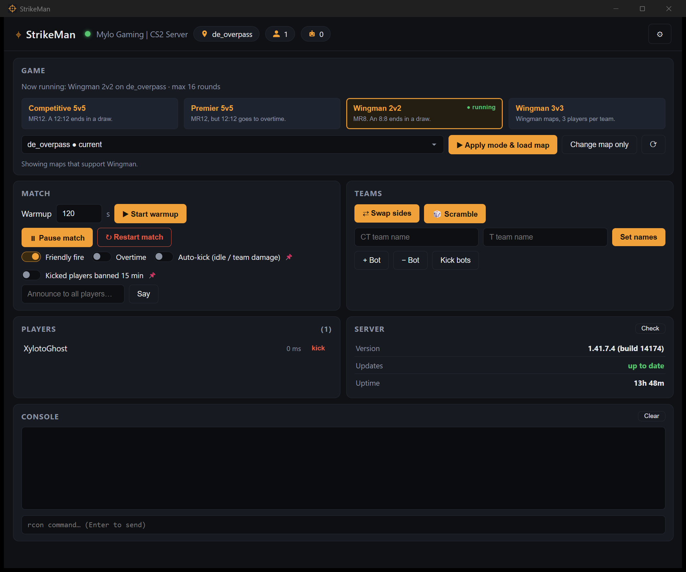

# StrikeMan

A small desktop app for managing a private Counter-Strike 2 server, so match
night does not happen in the RCON console.

## What it does

- **Pick a mode, pick a map, go.** Competitive, Premier, Wingman 2v2 and a
  **Wingman 3v3** preset for the games that never quite fit 2v2. The map list
  filters itself to maps that support the mode you chose, official ones and
  your Steam Workshop collection.
- **Run the match.** Warmup with a countdown, pause and resume, restart,
  swap sides, scramble, team names, bots, and announcements in chat.
- **Stop the annoying stuff.** Turn off auto-kick and the 15 minute ban that
  follows it, so joke team damage costs nothing. Your choice survives map
  changes.
- **See the server.** Players, current mode and map, version, uptime, and
  whether a CS2 server update is waiting.
- English and German, and a plain RCON console when you want one.

## Getting started

1. Grab the [latest release](https://github.com/XylotoGhost/StrikeMan/releases/latest):
   an installer (Windows `.exe`, macOS `.dmg`) or a portable archive for
   Windows, macOS and Linux. The Windows installer needs **no administrator
   rights**.
2. Start it, open ⚙ and enter the server address, RCON port and password.
   Passwords go to your operating system's credential store, never into a
   file in the repository.
3. Optionally add a Steam Workshop collection ID to get your custom maps in
   the map list.

StrikeMan keeps itself up to date: the Server card shows its own version and
offers a one-click update from GitHub, checksum-verified.

> Windows will warn that the download is unsigned — click **More info → Run
> anyway**. [Why, and how to verify the download instead](docs/install.md#windows-protected-your-pc).

## Documentation

- [Installing and updating](docs/install.md) — installer vs portable, the
  security warnings, checksums
- [Features in detail](docs/features.md) — what each preset and switch does
- [CS2 and RCON notes](docs/cs2-notes.md) — what the game does and does not
  allow over RCON, and why some things work the way they do
- [Development](docs/development.md) — building, tests, project layout

## License

MIT
